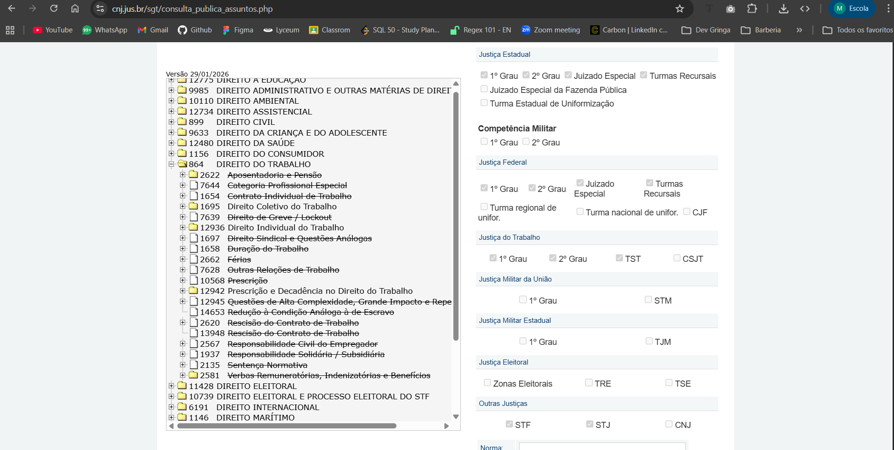

# Super Documento - Consolidado do Projeto TRT6

Este documento consolida os principais documentos do projeto em um unico lugar para facilitar leitura, onboarding e consulta.

## Indice

1. [Como Usar Este Documento](#como-usar-este-documento)
2. [README (Raiz)](#readme-raiz)
3. [Especificacao de Dados TRT6](#especificacao-de-dados-trt6)
4. [Pipeline](#pipeline)
5. [Solucao](#solucao)
6. [Topicos](#topicos)
7. [README do Captcha Service](#readme-do-captcha-service)
8. [Instrucoes Internas de OCR](#instrucoes-internas-de-ocr)
9. [Integracao entre captcha_service e ingestion_service](#integracao-entre-captcha_service-e-ingestion_service)
10. [Documentos PDF de Referencia](#documentos-pdf-de-referencia)

## Como Usar Este Documento

- Use o indice acima para navegar por tema.
- Cada secao abaixo inclui o conteudo integral do arquivo de origem.
- Quando precisar editar, altere o arquivo original indicado no titulo da secao.

---

## README (Raiz)

Fonte: [README.md](../README.md)


# projetos6 — JurisTCU API

REST API built with Django + Django REST Framework exposing the [LeandroRibeiro/JurisTCU](https://huggingface.co/datasets/LeandroRibeiro/JurisTCU) dataset.

---

## Requirements

- Python 3.13+
- [uv](https://github.com/astral-sh/uv) (package manager)

---

## Project structure

```
projetos6/
├── api/                        # Django project
│   ├── api/                    # Settings, URLs, WSGI
│   │   ├── settings.py
│   │   └── urls.py
│   ├── core/                   # Main app
│   │   ├── management/
│   │   │   └── commands/
│   │   │       └── load_juristcu.py  # Custom management command
│   │   ├── models.py
│   │   ├── serializers.py
│   │   └── views.py
│   ├── juristcu.db             # SQLite database (created after loading)
│   └── manage.py
├── pyproject.toml
└── README.md
```

---

## Setup

### 1. Install uv

**Linux / macOS**
```bash
curl -LsSf https://astral.sh/uv/install.sh | sh
```

**Windows (PowerShell)**
```powershell
powershell -ExecutionPolicy ByPass -c "irm https://astral.sh/uv/install.ps1 | iex"
```

**via pip** (any platform)
```bash
pip install uv
```

After installing, restart your shell and verify:
```bash
uv --version
```

### 2. Install dependencies

```bash
uv sync
```

### 3. Apply Django migrations

This creates the internal Django tables (auth, sessions, etc.) without touching the dataset tables.

```bash
cd api
python manage.py migrate
```

### 4. Load the dataset into SQLite

Downloads the dataset from HuggingFace and populates the `docs`, `qrels`, and `queries` tables.

```bash
python manage.py load_juristcu
```

Optional flags:

| Flag | Default | Description |
|---|---|---|
| `--repo` | `LeandroRibeiro/JurisTCU` | HuggingFace dataset repo |
| `--db` | settings `DATABASE` path | Override SQLite file path |
| `--if-exists` | `replace` | `replace` / `append` / `fail` |

Example with custom path:

```bash
python manage.py load_juristcu --db /tmp/custom.db --if-exists append
```

### 5. Run the development server

```bash
python manage.py runserver
```

---

## API endpoints

Base URL: `http://localhost:8000/api/`

| Method | URL | Description |
|---|---|---|
| `GET` | `/api/documents/` | List all documents (paginated) |
| `GET` | `/api/documents/{key}/` | Get a single document |

### Filtering

Append any of these as query parameters:

```
/api/documents/?area=Licitações
/api/documents/?ano_acordao=2023
/api/documents/?colegiado=Plenário&tipo_processo=TC
/api/documents/?paradigmatico=S
```

Available filter fields: `key`, `num_acordao`, `ano_acordao`, `colegiado`, `area`, `tema`, `subtema`, `tipo_processo`, `tipo_recurso`, `autor_tese`, `paradigmatico`.

---

## Especificacao de Dados TRT6

Fonte: [docs/Especificacao_Dados_TRT6.md](Especificacao_Dados_TRT6.md)


# Especificacao de dados TRT6 (JSON DataJud + PDF integra)

## 1) Exemplo de dado final (sample)
```json
{
  "processo_numero_cnj": "0000256-48.2025.5.06.0171",
  "processo_id_datajud": "TRT6_G1_00002564820255060171",
  "tribunal": "TRT6",
  "grau": "G1",
  "classe_nome": "Acao Trabalhista - Rito Sumarissimo",
  "orgao_julgador_nome": "1a Vara do Trabalho do Cabo",
  "data_ajuizamento": "2025-04-15",
  "tipo_ato_principal": "acordo_homologado",
  "decisao_resumo": "Acordo homologado com quitacao geral e previsao de multa por inadimplencia.",
  "palavras_chave_processo": ["pagamento de salario", "acordo judicial", "quitacao geral", "multa por inadimplencia"],
  "status_processo": "arquivado",
  "desfecho": "acordo_favoravel",
  "resultado_reclamante": "ganhou",
  "palavras_chave_desfecho": ["ACORDO HOMOLOGADO", "CONCILIACAO", "pagara ao reclamante", "R$ 2.500,00"],
  "valor_causa": 31399.70,
  "valor_acordo_total": 2500.00,
  "valor_pago_reclamante": 2500.00,
  "valor_pago_advogado": 750.00,
  "custas_valor": 50.00,
  "custas_percentual": 2.00,
  "prazo_pagamento_texto": "parcela unica ate 30.07.2025",
  "data_sentenca_pdf": "2026-01-16",
  "data_arquivamento_pdf": "2026-01-16",
}
```

## 2) Dicionario campo a campo: referencia, descricao e como obter

Legenda de fonte:
- DataJud = JSON retornado no formato hits.hits[*]._source
- PDF = texto extraido do arquivo de integra (via pypdf)
- Derivado = calculado a partir de DataJud e/ou PDF

| Campo | Descricao (o que e) | Fonte primaria | Referencia exata | Como obter (regra) |
|---|---|---|---|---|
| processo_numero_cnj | Numero CNJ unico do processo para identificacao logica. | DataJud | _source.numeroProcesso | Ler string e normalizar para formato CNJ com mascara quando necessario. |
| processo_id_datajud | Identificador tecnico do processo no retorno da API DataJud. | DataJud | _source.id | Copiar id tecnico retornado pela API. |
| tribunal | Sigla do tribunal de origem do processo. | DataJud | _source.tribunal | Copiar valor literal. |
| grau | Grau de jurisdicao do processo (G1 ou G2). | DataJud | _source.grau | Copiar valor literal (G1/G2). |
| classe_codigo | Codigo numerico da classe processual. | DataJud | _source.classe.codigo | Copiar inteiro. |
| classe_nome | Nome textual da classe processual. | DataJud | _source.classe.nome | Copiar texto. |
| orgao_julgador_codigo | Codigo do orgao julgador responsavel. | DataJud | _source.orgaoJulgador.codigo | Copiar codigo numerico/string. |
| orgao_julgador_nome | Nome do orgao julgador responsavel. | DataJud | _source.orgaoJulgador.nome | Copiar texto. |
| data_ajuizamento | Data de distribuicao/ajuizamento do processo. | DataJud | _source.dataAjuizamento | Converter AAAAMMDDhhmmss para data ISO (AAAA-MM-DD). |
| data_ultima_atualizacao_datajud | Momento da ultima atualizacao do processo na fonte. | DataJud | _source.dataHoraUltimaAtualizacao | Converter para datetime ISO UTC. |
| data_ato_principal_pdf | Data do principal ato decisorio identificado no PDF. | PDF | Texto do ato principal no PDF | Detectar bloco mais relevante (acordo/sentenca/acordao/despacho final) e extrair data do bloco. |
| data_sentenca_pdf | Data da sentenca quando houver sentenca no inteiro teor. | PDF | Bloco com palavra "SENTENCA" | Encontrar sentenca e extrair data da assinatura ou data textual do bloco. |
| data_arquivamento_pdf | Data do ato que determina o arquivamento dos autos. | PDF | Trechos com "arquivem-se" | Se houver comando de arquivamento, usar data do ato correspondente. |
| reclamante_nome | Nome da parte autora da reclamacao trabalhista. | PDF | Linha "RECLAMANTE:" | Regex apos marcador "RECLAMANTE:". |
| reclamado_nome | Nome da parte re no processo trabalhista. | PDF | Linha "RECLAMADO:" ou "RECLAMADO(A):" | Regex apos marcador de parte passiva. |
| assuntos | Lista de temas juridicos associados ao processo. | DataJud | _source.assuntos[*].nome | Mapear array de objetos para array de strings. |
| tipo_ato_principal | Classificacao do ato principal (despacho, acordo, sentenca, acordao, outro). | Derivado | PDF + movimentos DataJud | Classificar por palavras-chave: ACORDO HOMOLOGADO, SENTENCA, ACORDAO, DESPACHO. |
| decisao_resumo | Resumo textual curto do conteudo decisorio principal. | PDF | Bloco textual do ato principal | Resumir em 1-3 frases a partir do bloco identificado como principal. |
| status_processo | Situacao processual consolidada para consulta e analise. | Derivado | PDF + movimentos DataJud | Regras: "arquivem-se" => arquivado; "acordo homologado" => acordo_homologado; "sentenca" sem arquivamento => sentenciado; senao em_andamento. |
| desfecho | Classificacao final do resultado: acordo favoravel, sentenca procedente, improcedente, extinta, etc. | Derivado | PDF (blocos de ACORDO, SENTENCA, ACORDAO) | Usar padroes de palavras-chave conforme secao 4.1 para mapear a cada enum. |
| resultado_reclamante | Resumo binario/ternario: ganhou, ganhou_parcial, perdeu, sem_decisao. | Derivado | Campo "desfecho" mapeado para resultado. | ganhou => acordo favoravel ou sentenca procedente; perdeu => improcedente; ganhou_parcial => parcialmente procedente; sem_decisao => extinta ou em andamento. |
| palavras_chave_desfecho | Array de strings encontradas no PDF que levaram a classificacao do desfecho. | PDF | Blocos de ACORDO/SENTENCA/ACORDAO | Capturar termos como "ACORDO HOMOLOGADO", "CONCILIACAO", "procedente", "improcedente", "pagara ao reclamante", "R$ X", etc. |
| palavras_chave_processo | Array de temas juridicos e fatos relevantes do processo para indexacao semantica. | Derivado | Chunks relevantes do PDF integra + assuntos do DataJud | Extrair via RAG com recuperacao semantica dos trechos mais representativos e normalizar para termos canonicos (ex: "pagamento de salario", "verbas rescisorias", "jornada de trabalho", "acordo judicial", "quitacao geral", "inadimplencia"). |
| valor_causa | Valor economico atribuido a causa no processo. | PDF | Linha "Valor da causa" | Regex monetaria apos marcador "Valor da causa:" e normalizar para decimal. |
| valor_acordo_total | Valor total pactuado no acordo homologado. | PDF | Bloco "CONCILIACAO"/"ACORDO HOMOLOGADO" | Capturar valor total do acordo quando expresso como importancia total. |
| valor_pago_reclamante | Valor financeiro destinado ao reclamante no acordo/decisao. | PDF | Bloco de pagamento ao reclamante | Regex em frase "pagara ao reclamante ... R$ X". |
| valor_pago_advogado | Valor financeiro destinado ao advogado do reclamante. | PDF | Bloco de pagamento ao advogado | Regex em frase "pagara ao advogado ... R$ X". |
| custas_valor | Valor absoluto das custas processuais. | PDF | Linha com "Custas ... R$" | Regex de valor monetario apos marcador "Custas". |
| custas_percentual | Percentual de custas aplicado no ato. | PDF | Linha com "Custas" e "%" | Regex de percentual no mesmo trecho das custas. |
| raw_pdf_texto | Conteudo bruto do texto integral extraido do PDF. | PDF | Texto extraido integral | Persistir texto bruto extraido do PDF. |

## 9) Evidencias concretas no caso exemplo (0000256-48.2025.5.06.0171)

Trechos no texto extraido em captcha_service/documents/00002564820255060171_integra_http_extracted.txt:
- "Valor da causa: R$ 31.399,70" -> valor_causa
- "RECLAMANTE: LEANDRO ..." -> reclamante_nome
- "RECLAMADO: ECAM ..." -> reclamado_nome
- "ACORDO HOMOLOGADO." -> tipo_ato_principal/status_processo/desfecho/resultado_reclamante
- "A esta altura as partes resolveram conciliar" -> palavras_chave_desfecho
- "pagara ao reclamante ... R$ 2.500,00" -> valor_pago_reclamante + palavras_chave_desfecho
- "Custas ... R$ 50,00, 2%" -> custas_valor/custas_percentual
- "Multa de 100% ..." -> multa_inadimplencia_percentual
- "SENTENCA" + "arquivem-se" + data "16 de janeiro de 2026" -> data_sentenca_pdf/data_arquivamento_pdf

Exemplos recomendados de palavras-chave para indexacao via RAG:
- palavras_chave_processo: ["pagamento de salario", "rescisao indireta", "verbas rescisorias", "jornada de trabalho", "acordo judicial", "quitacao geral", "inadimplencia"]
- palavras_chave_desfecho (acordo_favoravel): ["ACORDO HOMOLOGADO", "CONCILIACAO", "pagara ao reclamante", "quitacao geral", "resolucao de merito"]
- palavras_chave_desfecho (sentenca_procedente): ["julgo procedente", "condeno a reclamada", "procedencia dos pedidos"]
- palavras_chave_desfecho (sentenca_parcialmente_procedente): ["julgo parcialmente procedente", "procedente em parte", "deferido em parte"]
- palavras_chave_desfecho (sentenca_improcedente): ["julgo improcedente", "indeferidos os pedidos", "rejeito os pedidos"]
- palavras_chave_desfecho (sentenca_extinta/arquivado_sem_decisao): ["extingo o processo", "sem resolucao de merito", "arquivem-se os autos"]

Referencias no JSON DataJud (estrutura):
```json
hits.hits[0]._source.numeroProcesso
hits.hits[0]._source.id
hits.hits[0]._source.tribunal
hits.hits[0]._source.grau
hits.hits[0]._source.classe.codigo
hits.hits[0]._source.classe.nome
hits.hits[0]._source.dataAjuizamento
hits.hits[0]._source.dataHoraUltimaAtualizacao
hits.hits[0]._source.orgaoJulgador.codigo
hits.hits[0]._source.orgaoJulgador.nome
hits.hits[0]._source.assuntos[*].nome
hits.hits[0]._source.movimentos[*]
```


---

## Pipeline

Fonte: [docs/Pipeline.md](Pipeline.md)


This bulk ingestion strategy with the **Adapter** pattern ensures scalability and maintainability, supporting **DataJud** now and other sources (official gazettes, court APIs) in the future.

Here is the **Reverse Engineering** structure for this logical flow:

### 3. Reverse Engineering and Programming Logic (The "How")

#### **A. Data Input and Sources**

* **Data Entry:** Data enters the system through **HTTP GET/POST** requests to the DataJud `_search` endpoint. The system uses a dynamic `size` parameter (e.g., 50) to extract the maximum number of matches per request, optimizing case collection from **TRT6**.

* **External Sources:** The feature depends on the **CNJ Public API (DataJud)**. The system implements the **Adapter** pattern to translate the API's native JSON (such as `subjects` and `movements` fields) into a unified interface for the internal dataset.

#### **B. Processing and Business Logic (Backend)**

* **Triggers:** The flow is triggered by a synchronization job that sends the topic list and receives the data batch from the API.

* **Algorithms:**
    * **Deduplication:** A method receives the Adapter's object list and performs a set difference operation, comparing the `caseNumber` with existing database records to filter only new items.
    * **Vectorization:** After filtering, new records pass through **NLP** models to generate **embeddings** from summaries before persistence.

* **Data Structure:** The system uses a **hybrid** architecture:
    * **Relational:** Where **Bulk Create** executes to save metadata (amounts, dates, courts) atomically and performantly.
    * **Vector:** Where corresponding vectors are stored to enable similarity search.

#### **C. Performance and Feedback (Frontend)**

* **Interface States:** The **SPA** uses **skeleton screens** to indicate batch processing progress and duplicate verification status in the backend.

* **Real-Time Updates:** The frontend uses **asynchronous HTTP calls** to update dataset counters and jurimetrics dashboards once the **Bulk Create** is confirmed by the server, ensuring users see database growth without page reload.

---

**Backend Flow Mapping:**

1. **Request:** Fetch 50 records per topic from DataJud.
2. **Adapter:** Normalize JSON to the `LaborCase` interface.
3. **Filter:** `get_non_existent(api_list)` → returns only new IDs.
4. **Bulk Create:** Saves new cases in a single transaction.

Would you like help defining a unified Adapter interface to ensure fields like "Moral Damage Compensation" map consistently across sources?

---

## Solucao

Fonte: [docs/Solução.md](Solu%C3%A7%C3%A3o.md)


O **Direito do Trabalho em Pernambuco (TRT6)** é um excelente recorte: há volume de dados e padrões de sentenças muito claros.

Aqui está um mapeamento estruturado de requisitos para essa solução de busca vetorial:

---

### 1. Requisitos Funcionais (O que o sistema faz)

#### **Busca e Inteligência (Core)**

* **Busca Semântica (Vetorial):** O usuário deve pesquisar por linguagem natural (ex: "trabalho 12h sem intervalo") e o sistema retornar casos com o mesmo contexto jurídico, não apenas palavras-chave.
* **Cálculo de Similaridade:** Exibir um "Score de Similaridade" entre o relato do usuário e os acórdãos encontrados.
* **Extração de Padrões:** Identificar automaticamente nos resultados:
    * Percentual de procedência (Sucesso).
    * Valor médio de indenização para aquele tema.
    * Tempo médio de tramitação.


#### **Visualização e Dashboards**

* **Análise de Jurisprudência:** Gráficos mostrando como diferentes varas ou juízes de PE decidem sobre o tema.
* **Argumentação Relevante:** Lista de tópicos (sumas, artigos da CLT) mais citados nos casos de sucesso.
* **Filtros Avançados:** Recorte por empresa (ré), faixa de valores, data e órgão julgador.

---

### 2. Requisitos Não-Funcionais (Qualidade e Técnica)

* **Processamento de Linguagem Natural (NLP):** Utilização de modelos de *embeddings* treinados ou ajustados para o "juridiquês" brasileiro (ex: Legal-BERT ou modelos da OpenAI/Cohere).
* **Escalabilidade da Base de Vetores:** Uso de um Vector Database (Pinecone, Milvus ou Weaviate) para garantir que a busca não trave com o aumento do dataset do DataJud.
* **Atualização de Dados:** Sincronização periódica com o DataJud/TRT6 para manter a base relevante.

---

### 3. Diferenciais em relação aos concorrentes

| Concorrente | Onde você pode ganhar |
| --- | --- |
| **Jusbrasil/Digesto** | Eles são generalistas. Você ganha na **especificidade** (ex: análise preditiva focada em PE). |
| **Harvey AI** | Focado em grandes bancas e alto custo. Sua solução pode ser focada na **acessibilidade** para o advogado autônomo ou o próprio trabalhador. |
| **DataJud (API)** | O DataJud é o dado bruto. Sua entrega é a **interpretação** e o visual (dashboards). |

---

### 4. Sugestão de Escopo Inicial (MVP)

Para o seu projeto de **LegalTech**, sugiro fechar o cerco da seguinte forma:

1. **Fonte:** Apenas processos do **TRT6 (Pernambuco)**.
2. **Tópico:** Apenas **Jornada de Trabalho** (Horas extras, 12x36, supressão de intervalo).
3. **Output:** O sistema entrega os 5 casos mais similares e um painel resumindo se aquele tribunal costuma dar ganho de causa ou não para o argumento usado.

---

## Topicos

Fonte: [docs/Tópicos.md](T%C3%B3picos.md)


https://www.cnj.jus.br/sgt/consulta_publica_assuntos.php

https://huggingface.co/neuralmind/bert-base-portuguese-cased -> TEXTO PT-BR em VETORES


---

## README do Captcha Service

Fonte: [captcha_service/README.md](../captcha_service/README.md)


# pje-scraper

Automação do fluxo de consulta processual no **PJe TRT-6** (`pje.trt6.jus.br/consultaprocessual`):  
busca processo → seleciona grau → resolve captcha via `ddddocr` → retorna `tokenCaptcha` pronto para uso na API.

## Pré-requisitos

- Python 3.11+
- Chromium (instalado via Playwright)

## Instalação

```bash
# A partir da raiz do repositório
pip install -e captcha_service/

# Instala o browser Chromium para o Playwright
playwright install chromium
```

## Uso — linha de comando

Após instalar o pacote, o comando `pje-scraper` fica disponível globalmente:

```bash
# Sintaxe
pje-scraper <numero_processo> [grau] [--no-headless]

# Exemplos
pje-scraper 0000573-11.2025.5.06.0021
pje-scraper 0000573-11.2025.5.06.0021 2
pje-scraper 0000573-11.2025.5.06.0021 1 --no-headless   # abre o navegador visível
```

Saída esperada:
```
processo_id  : 123456
grau         : 1
captcha_text : 3n3D
tokenDesafio : abc123...
tokenCaptcha : xyz789...
```

## Uso — script principal

```bash
# Via main.py (captura o PDF final interceptando o fetch do navegador)
python captcha_service/main.py 0000573-11.2025.5.06.0021
python captcha_service/main.py 0000573-11.2025.5.06.0021 1 --no-headless
```

## Uso — Python

```python
from pje_scraper import PjePipeline

pipeline = PjePipeline()                          # headless=True por padrão
session = pipeline.resolve("0000573-11.2025.5.06.0021", grau="1")

print(session.token_captcha)   # token pronto para a API

# Fluxo recomendado: capturar o PDF no response que o navegador já faz
capture = pipeline.resolve_and_capture_pdf("0000573-11.2025.5.06.0021", grau="1")
path = pipeline.save_captured_pdf(capture)
print(path)

# Opcional: buscar documentos do processo diretamente
resp = pipeline.fetch_with_token(session)
print(resp.json())
```

### `CaptchaSession` — campos retornados

| Campo | Descrição |
|---|---|
| `numero_processo` | Número CNJ do processo |
| `grau` | `"1"` ou `"2"` |
| `processo_id` | ID interno usado na API do PJe |
| `token_desafio` | Token do desafio captcha |
| `token_captcha` | Token resultante após resolver o captcha |
| `captcha_text` | Texto reconhecido pelo OCR |

## Estrutura do pacote

```
captcha_service/
├── pje_scraper/
│   ├── captcha.py    # CaptchaSolver: wrapper do ddddocr (OCR local)
│   ├── scraper.py    # PjeScraper: automação Playwright
│   ├── pipeline.py   # PjePipeline: orquestra tudo + entry point CLI
│   └── models.py     # Dataclasses: CaptchaSession, ProcessInfo, GrauInfo
├── main.py           # Script principal: resolve captcha + busca documentos
└── pyproject.toml
```

## Páginas de referência

As capturas HTML em `pagina inicial/`, `pagina com captcha/` e `mais de um grau trt6/` documentam a estrutura real das páginas usadas na automação.

---

## Instrucoes Internas de OCR

Fonte: [.github/instructions/captcha-ocr.instructions.md](../.github/instructions/captcha-ocr.instructions.md)

---
description: "Use when editing captcha_service OCR pipeline, captcha parsing, or related tests. Enforces charset constraints for TRT-6 captcha and uv-based environment workflow."
name: "Captcha OCR Constraints"
applyTo:
    - "captcha_service/main.py"
    - "captcha_service/test.py"
    - "captcha_service/pyproject.toml"
    - "captcha_service/pje_scraper/**/*.py"
---

# Captcha OCR Constraints

- Assume TRT-6 captcha contains only lowercase letters a-z and digits 0-9.
- Never treat uppercase letters as valid final output; normalize to lowercase before returning OCR text.
- Never keep symbols or foreign characters in final OCR output; filter to allowed charset.
- Handle frequent OCR confusions with explicit normalization mappings when validated by dataset examples.

## Environment and Commands

- Use uv as the package manager for Python tasks in this workspace.
- Prefer commands in this form: uv run python ...
- Do not suggest pip install flows when uv and the existing virtual environment are available.

## Testing Expectations

- Validate changes against captcha_service/data/images.json whenever OCR behavior changes.
- In diagnostics, report raw OCR output and normalized output separately.
- If a normalization rule is added, include a short test-visible trace that helps confirm the rule was applied.

---

## Integracao entre captcha_service e ingestion_service

Fonte: [docs/Integracao_Captcha_Ingestion.md](Integracao_Captcha_Ingestion.md)

Este documento define uma proposta de interface entre os servicos com:

- arquitetura em camadas (domain/application/infrastructure/interface)
- contratos de dados entre captura e ingestao
- aplicacao de SRP, OCP e DIP com portas e adaptadores
- opcoes de integracao (in-process, REST interno, eventos/fila)
- plano evolutivo em 3 fases
- praticas de idempotencia, observabilidade, resiliencia e testes

---

## Documentos PDF de Referencia

Arquivos de referencia disponiveis em [docs/](.):

- [docs/Documento_29d9dcc.pdf](Documento_29d9dcc.pdf)
- [docs/Documento_85466da.pdf](Documento_85466da.pdf)
- [docs/Documento_9bda806.pdf](Documento_9bda806.pdf)

Observacao: os PDFs sao binarios e por isso nao sao incorporados inline neste consolidado.
